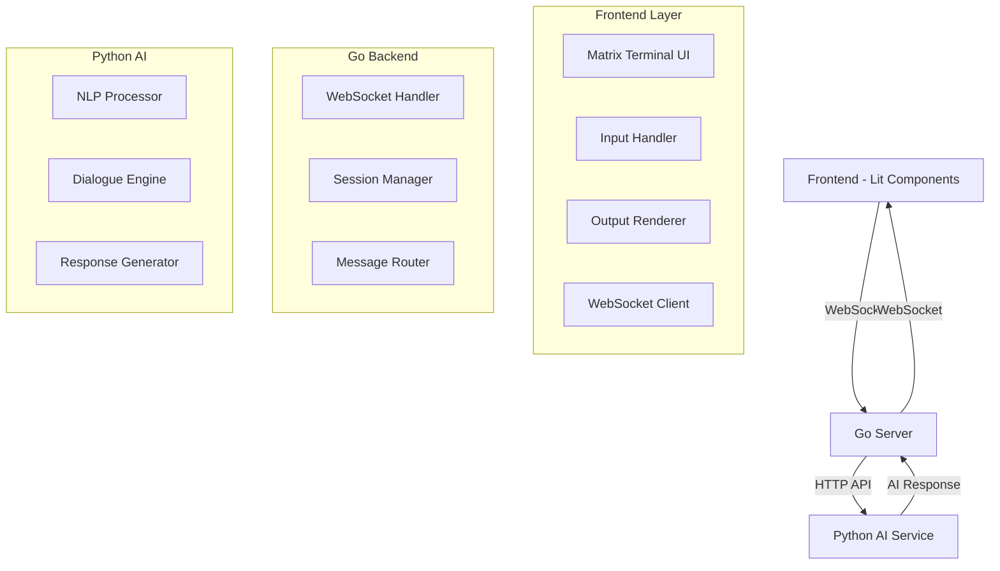

# Matrix-Style Interactive Terminal

A stylized interface that replicates a Linux terminal with a Matrix-style aesthetic, featuring interactive command-line sessions with AI-driven dialogue and real-time WebSocket communication.

## 🎯 Project Overview

This project simulates an interactive terminal environment where:

- The terminal **asks** users questions or offers multiple actions
- Users **respond** with input that triggers further prompts or actions  
- The interface flows like a real CLI environment with stateful interaction
- All interactions are enhanced with Matrix-style visual effects

## 🛠 Technology Stack

### Frontend

- **Lit Web Components** with TypeScript
- Matrix-style theme (green-on-black, monospace fonts)
- CSS animations (flicker effects, scanlines, typing simulation)
- WebSocket client for real-time communication

### Backend

- **Go**: Real-time interaction server
  - WebSocket server for live communication
  - Session state management
  - Message routing and broadcasting
- **Python**: AI/NLP processing engine
  - Natural language processing for user input
  - Dynamic dialogue generation
  - Conversation flow logic

## 📁 Project Structure

```text
ConvAnalytics/
├── src/
│   ├── frontend/                    # Lit Web Components (TypeScript)
│   │   ├── components/              # Terminal UI components
│   │   │   ├── matrix-terminal.ts   # Main terminal component
│   │   │   ├── terminal-input.ts    # Input handling component
│   │   │   ├── terminal-output.ts   # Output rendering component
│   │   │   └── terminal-cursor.ts   # Animated cursor component
│   │   ├── styles/                  # Matrix-style CSS
│   │   │   ├── matrix-theme.css     # Main theme styles
│   │   │   ├── animations.css       # Typing/flicker animations
│   │   │   └── terminal.css         # Terminal-specific styles
│   │   ├── services/                # Communication layer
│   │   │   ├── websocket-client.ts  # WebSocket connection manager
│   │   │   └── terminal-api.ts      # API communication service
│   │   └── types/                   # TypeScript definitions
│   │       ├── terminal.ts          # Terminal state interfaces
│   │       └── messages.ts          # WebSocket message types
│   └── backend/
│       ├── go/                      # Go WebSocket server
│       │   ├── cmd/
│       │   │   └── server/
│       │   │       └── main.go      # Server entry point
│       │   └── internal/
│       │       ├── handlers/        # HTTP/WebSocket handlers
│       │       ├── models/          # Data structures
│       │       ├── websocket/       # WebSocket management
│       │       └── session/         # Terminal session state
│       └── python/                  # Python AI/NLP module
│           ├── app/
│           │   ├── main.py          # FastAPI server entry point
│           │   ├── nlp/             # Natural language processing
│           │   │   ├── processor.py # Input interpretation
│           │   │   └── analyzer.py  # Sentiment/intent analysis
│           │   ├── dialogue/        # Conversation flow
│           │   │   ├── engine.py    # Main dialogue engine
│           │   │   ├── prompts.py   # Question generation
│           │   │   └── responses.py # Response templates
│           │   └── models/          # Data models
│           │       ├── session.py   # Session data models
│           │       └── message.py   # Message structures
│           └── requirements.txt     # Python dependencies
├── tests/                           # Testing suite
│   ├── frontend/                    # Frontend unit tests
│   ├── backend/                     # Backend unit tests
│   └── integration/                 # End-to-end tests
├── docs/                            # Documentation
├── scripts/                         # Build/deployment scripts
├── public/                          # Static assets
└── config/                          # Configuration files
```

## 🚀 Getting Started

### Prerequisites

- **Node.js** (v18+) and npm
- **Go** (v1.20+)
- **Python** (v3.9+) and pip

### Installation

1. **Clone the repository**

   ```bash
   git clone <repository-url>
   cd ConvAnalytics
   ```

2. **Install Frontend Dependencies**

   ```bash
   cd src/frontend
   npm install
   ```

3. **Install Go Dependencies**

   ```bash
   cd src/backend/go
   go mod init convanalytics
   go mod tidy
   ```

4. **Install Python Dependencies**

   ```bash
   cd src/backend/python
   pip install -r requirements.txt
   ```

### Development Setup

1. **Start the Go WebSocket Server**

   ```bash
   cd src/backend/go
   go run cmd/server/main.go
   ```

   Server runs on `ws://localhost:8080`

2. **Start the Python AI Service**

   ```bash
   cd src/backend/python
   python -m app.main
   ```

   Service runs on `http://localhost:8000`

3. **Start the Frontend Development Server**

   ```bash
   cd src/frontend
   npm run dev
   ```

   Frontend available at `http://localhost:3000`

### Quick Start Script

```bash
# Use the convenience script to start all services
./scripts/dev-start.sh
```

## 🎮 How It Works

### Architecture Flow



### Interaction Flow

1. **Session Initialization**
   - User opens terminal interface
   - WebSocket connection established with Go server
   - Go server creates new session
   - Python AI generates welcome message and initial prompt

2. **User Input Processing**
   - User types command/response in terminal
   - Frontend sends message via WebSocket to Go server
   - Go server forwards to Python AI service
   - Python processes input using NLP and generates response

3. **Response Delivery**
   - Python returns structured response to Go server
   - Go server broadcasts to connected WebSocket clients
   - Frontend receives response and renders with typing animation
   - Session state updated for conversation continuity

## 🎨 Matrix Theme Features

### Visual Effects

- **Green-on-black color scheme** with customizable intensity
- **Monospace font rendering** (Fira Code, Consolas, Monaco)
- **Scanline animations** with adjustable opacity
- **Flicker effects** for authentic CRT monitor feel
- **Typing animations** for simulated real-time response

### Terminal Behaviors

- **Line-by-line output rendering** with scrollback support
- **Blinking cursor** with customizable timing
- **Command history** navigation (↑/↓ arrows)
- **Auto-scrolling** to follow conversation
- **Session persistence** across page refreshes

## 🧪 Testing

### Run All Tests

```bash
# Frontend tests
npm run test

# Go backend tests
cd src/backend/go && go test ./...

# Python backend tests
cd src/backend/python && python -m pytest

# Integration tests
npm run test:integration
```

### Test Categories

- **Unit Tests**: Individual component testing
- **Integration Tests**: Service-to-service communication
- **E2E Tests**: Full user interaction flows
- **Performance Tests**: WebSocket load testing

## 📝 API Documentation

### WebSocket Messages

#### Client → Server

```typescript
interface UserMessage {
  type: 'user_input';
  sessionId: string;
  content: string;
  timestamp: number;
}
```

#### Server → Client

```typescript
interface AIResponse {
  type: 'ai_response';
  sessionId: string;
  content: string;
  prompt?: string;
  options?: string[];
  timestamp: number;
}
```

### Python AI Endpoints

- `POST /process` - Process user input and generate response
- `GET /session/{id}` - Retrieve session state
- `POST /session/{id}/reset` - Reset conversation state

## 🔧 Configuration

### Environment Variables

```bash
# Go Server
PORT=8080
WS_ORIGIN=http://localhost:3000

# Python Service  
PYTHON_HOST=localhost
PYTHON_PORT=8000
NLP_MODEL=en_core_web_sm

# Frontend
VITE_WS_URL=ws://localhost:8080
VITE_API_URL=http://localhost:8000
```

## 🚀 Deployment

### Docker Deployment

```bash
# Build and run all services
docker-compose up --build
```

### Production Build

```bash
# Build frontend for production
npm run build

# Build Go binary
go build -o bin/server cmd/server/main.go

# Package Python service
pip freeze > requirements.txt
```

## 🤝 Contributing

1. Fork the repository
2. Create feature branch (`git checkout -b feature/amazing-feature`)
3. Commit changes (`git commit -m 'Add amazing feature'`)
4. Push to branch (`git push origin feature/amazing-feature`)
5. Open Pull Request

## 📄 License

This project is licensed under the MIT License - see the [LICENSE](LICENSE) file for details.

## 🎯 Roadmap

- [ ] Voice input/output integration
- [ ] Multi-language NLP support
- [ ] Custom terminal themes
- [ ] Plugin architecture for commands
- [ ] Mobile-responsive design
- [ ] Advanced AI conversation models
- [ ] Real-time collaboration features

---

Built with ❤️ using Lit, Go, and Python
